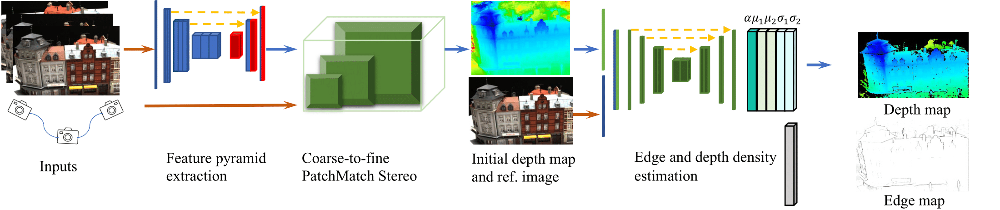
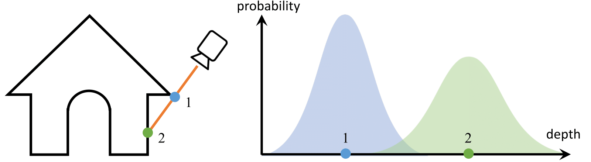

# DDLMVS
Official source code for  [DDL-MVS: Depth Discontinuity Learning for MVS Networks
](https://arxiv.org/abs/2203.01391)
# #####################################################




## Abstract
Traditional MVS methods have good accuracy but struggle with completeness, while recently developed learning-based multi-view stereo (MVS) techniques have improved completeness except accuracy being compromised. We propose depth discontinuity learning for MVS methods, which further improves accuracy while retaining the completeness of the reconstruction. Our idea is to jointly estimate the depth and boundary maps where the boundary maps are explicitly used for further refinement of the depth maps. We validate our idea and demonstrate that our strategies can be easily integrated into the existing learning-based MVS pipeline where the reconstruction depends on high-quality depth map estimation. Extensive experiments on various datasets show that our method improves reconstruction quality compared to baseline. Experiments also demonstrate that the presented model and strategies have good generalization capabilities. 


## Installation


```bash
conda env create -f environment.yml
conda activate ddlmvs
```

## Reproducing Results


We are using the same kind of input as our baseline (PatchmatchNet) using.
* Download pre-processed dataset from the link provided by Fangjinhua Wang: [DTU's evaluation set](https://drive.google.com/file/d/1jN8yEQX0a-S22XwUjISM8xSJD39pFLL_/view?usp=sharing), [Tanks & Temples](https://drive.google.com/file/d/1gAfmeoGNEFl9dL4QcAU4kF0BAyTd-r8Z/view?usp=sharing). Each dataset is already organized as follows:
```
root_directory
├──scan1 (scene_name1)
├──scan2 (scene_name2) 
      ├── images                 
      │   ├── 00000000.jpg       
      │   ├── 00000001.jpg       
      │   └── ...                
      ├── cams_1                   
      │   ├── 00000000_cam.txt   
      │   ├── 00000001_cam.txt   
      │   └── ...                
      └── pair.txt  
```
Camera file ``cam.txt`` stores the camera parameters, which includes extrinsic, intrinsic, minimum depth and maximum depth:
```
extrinsic
E00 E01 E02 E03
E10 E11 E12 E13
E20 E21 E22 E23
E30 E31 E32 E33

intrinsic
K00 K01 K02
K10 K11 K12
K20 K21 K22

DEPTH_MIN DEPTH_MAX 
```
``pair.txt `` stores the view selection result. For each reference image, 10 best source views are stored in the file:
```
TOTAL_IMAGE_NUM
IMAGE_ID0                       # index of reference image 0 
10 ID0 SCORE0 ID1 SCORE1 ...    # 10 best source images for reference image 0 
IMAGE_ID1                       # index of reference image 1
10 ID0 SCORE0 ID1 SCORE1 ...    # 10 best source images for reference image 1 
...
``` 
## Training
### DTU
```python
python train.py --dataset dtu_yao --batch_size 4 --epochs 8 \
--patchmatch_iteration 1 2 2 --patchmatch_range 6 4 2 \
--patchmatch_num_sample 8 8 16 --propagate_neighbors 0 8 16 --evaluate_neighbors 9 9 9 \
--patchmatch_interval_scale 0.005 0.0125 0.025 \
--trainpath=MVS_TRAINING_PATH --trainlist lists/dtu/train.txt --vallist lists/dtu/val.txt \
--logdir ./CHECKPOINT_FOLDER
```

## Evaluation
### DTU
```python
python eval.py --dataset=dtu_yao_eval --batch_size=1 --n_views 5 \
--patchmatch_iteration 1 2 2 --patchmatch_range 6 4 2 \
--patchmatch_num_sample 8 8 16 --propagate_neighbors 0 8 16 --evaluate_neighbors 9 9 9 \
--patchmatch_interval_scale 0.005 0.0125 0.025 \
--testpath=DTU_TESTING_PATH --geo_pixel_thres=1 --geo_depth_thres=0.01 --photo_thres 0.8 \
--outdir=./outputs --testlist lists/dtu/test.txt --loadckpt CHECKPOINT_MODEL_PATH
```
### Tanks and Temples
```python
python eval_tank.py --dataset=tanks --split intermediate --batch_size=1 --n_views 7 \
 --patchmatch_iteration 1 2 2 --patchmatch_range 6 4 2 \
 --patchmatch_num_sample 8 8 16 --propagate_neighbors 0 8 16 --evaluate_neighbors 9 9 9 \
 --patchmatch_interval_scale 0.005 0.0125 0.025 \
 --testpath=TANK_PATH --geo_pixel_thres=1 --geo_depth_thres=0.01 \
 --outdir ./outputs_tanks --loadckpt CHECKPOINT_MODEL_PATH
```
### Custom Dataset
```python
 python eval_custom.py --dataset=custom --batch_size=1 --n_views 5 \
 --patchmatch_iteration 1 2 2 --patchmatch_range 6 4 2 \
 --patchmatch_num_sample 8 8 16 --propagate_neighbors 0 8 16 --evaluate_neighbors 9 9 9 \
 --patchmatch_interval_scale 0.005 0.0125 0.025 \
 --testpath=CUSTOM_DATA_PATH --geo_pixel_thres=1 --geo_depth_thres=0.01 --photo_thres 0.8 \
 --outdir ./outputs_custom --loadckpt CHECKPOINT_MODEL_PATH
```
### Related Papers
* [PatchmatchNet: Learned Multi-View Patchmatch Stereo](https://openaccess.thecvf.com/content/CVPR2021/papers/Wang_PatchmatchNet_Learned_Multi-View_Patchmatch_Stereo_CVPR_2021_paper.pdf)
* [MVSNet: Depth Inference for Unstructured Multi-view Stereo](https://arxiv.org/abs/1804.02505)
* [SMD-Nets: Stereo Mixture Density Networks](https://arxiv.org/abs/2104.03866)

## Acknowledgements

Our work is reusing and adapting some of the code of the following papers:

Thanks to Fangjinhua Wang for open sourcing [PathmatchNet](https://github.com/FangjinhuaWang/PatchmatchNet). 

Thanks to Yao Yao and Xiaoyang Guo for opening source  [MVSNet](https://github.com/YoYo000/MVSNet), [MVSNet-pytorch](https://github.com/xy-guo/MVSNet_pytorch).
